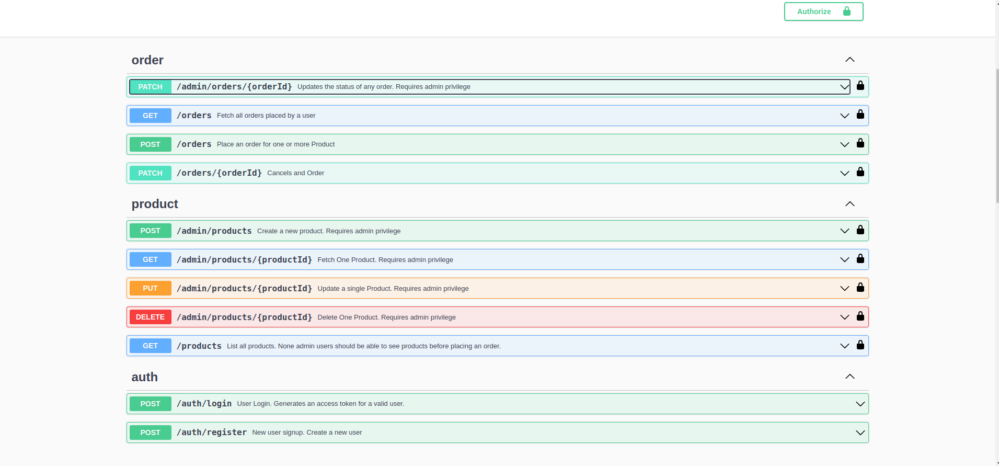

# E-commerce API

## Objective
Create a RESTful API for an e-commerce application. This API will handle basic CRUD operations for products and orders, and provide user management and authentication.

## API Doc
Hosted: [Live Docs](https://getinstashop-ecommerce-api.onrender.com/swagger/index.html)

Local: http://localhost:8080/swagger/index.html

###  Authentication Method
The **Bearer Authorization header** is the mechanism used to authenticate the API calls.
- Login with the registered email and password, a **JWT** access token will be sent back by the server
- Use the token to authenticate requests by including it as a bearer token in the authorization header as shown below:
```
Authorization: Bearer <access_token>
```

To successfully test local, kindly make the blow modifications
- On `line 35` in [main.go](./main.go) replace `// @host      getinstashop-ecommerce-api.onrender.com` with `// @host      localhost:8080`
- On `line 38` [main.go](./main.go) replace `// @schemes https http` with `// @schemes http https`

<p align="center">
  
</p>

## Tools
- Golang version ^1.22
- PostgresSQL version 15.0
- Docker Engine

## Development SetUp
The application can be run on both host machine and in a containerised environment

### Clone the Repository
```
~$ git clone https://github.com/SlamChillz/getinstashop-ecommerce-api.git
~$ cd getinstashop-ecommerce-api
```

### Environment Variables
- Rename `.env.example` to `.env`
- Update the `.env` with valid variable values

### Run on Host Machine
- Ensure the postgres server is running either locally or remotely
- Run `~$ go mod tidy` to install and update dependencies
- Build the application `~$ go build -o bin/server .`
- Create admin user for test by running: `./bin/server -email="admin@gmail.com" -password="adminpassword"`
- Start the application  `./bin/server`

### Run using Docker
- Rename `.env.example` to `.env.dev`
- Update the `.env.dev` with valid variable values
- Create admin user by replacing `line 6` in `start.sh` with the preferred admin credentials
- Run `docker compose up`

## Key Implementations
- Authenticated users can list all `products`. This allows them to know the which `product` to place order for.
- When a user cancels an order, the stock of all products in that order is incremented by the quantity that was ordered for. All Writes on the affect rows are locked until the transaction is finished. This prevents partial updates and false product stock that can result from concurrent writes.
- An order status can be in just one of this states at a time `PENDING`, `CANCELLED`, `COMPLETED`.
- It is assumed that An admin can change the state an order an any time. Here is what happens to the product stocks when order status changes from:
  - `PENDING` to `CANCLLED`: product stock is incremented by the quantity that was ordered for
  - `PENDING` to `COMPLETED`: product stock does not change
  - `CANCELLED` to `PENDING` && `CANCELLED` to `COMPLETED`: If all product stock balance is greater than their respective quantity in the order, then this succeeds else it fails
  - `COMPLETED` to `PENDING`: current product stock of all products in the order remains unchanged.
  - `COMPLETED` to `CANCELLED`: all stock of products in the order is increased by their respective order quantity.
